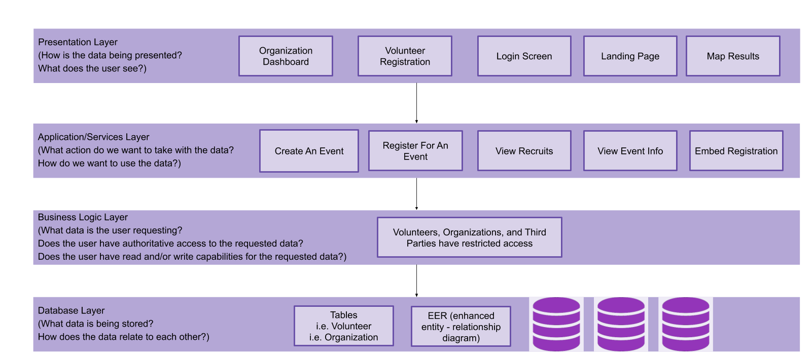
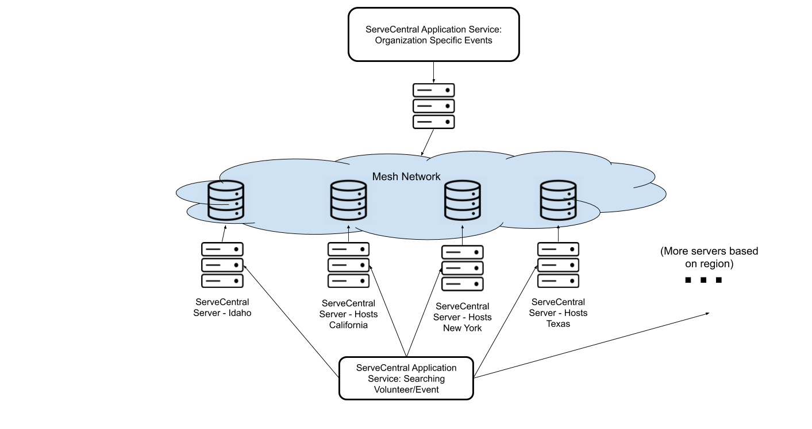

# Lab Report Template for CIS411_Lab1
Course: Messiah College CIS 411, Fall 2018
Instructors: [Joel Worrall](https://github.com/tangollama) & [Trevor Bunch](https://github.com/trevordbunch) 
Name: Leanne Weaver
GitHub: [Leanne-Weaver](https://github.com/Leanne-Weaver) 
Collaborators: [Matt Ly](https://github.com/MattLy21), [Ethan Wong](https://github.com/ethanwwm), and [Matt Bromley](https://github.com/mb1628) 
*I included classmates in the Collaborators section if I discussed any part of the project with him or asked to view their work for referencial purposes.*

# Step 0: Reviewing Architectural Patterns
See the [lecture / discussion](https://docs.google.com/presentation/d/1nUcy63FWPFYO3OJmERJpMjEtdaFtaIBbuUkpmNRVRas/edit#slide=id.g45345bd5ea_0_136) from CIS 411. You'll need to be familiar with the content from this lecture to complete this assignment.

Note: you are free to work with classmates on this assignment. _Good architecture is born out of collaboration - not reclusive mad-scientist behavior._ However, if you work with colleagues:

1. You must specifically note your collaborators by name at the top of your report.
2. You may not completely copy each others work (diagrams and descriptions, even if your solutions are identical).

# Step 1: MVC Architecture
Review the proposals for the Serve Central project. Let's imagine that the project has been granted (relatively) unlimited resources if they can deliver a version 1 release in 120 days. As a result, the team decides to implement an MVC architecture for its version 1 release, delivering functionality through a [responsive web application](https://en.wikipedia.org/wiki/Responsive_web_design). 

Based on the [this](https://docs.google.com/presentation/d/1UnU0xU0wF1l8pAB8trtLpdM0yuskx66jTFJzd64nsjU/edit#slide=id.g439b9c6866_2_53) and [this](https://docs.google.com/presentation/d/1-VZfAFoBVr6ijNepKAtRA7JoAQsV2Jlbf2l1WPDMhI0/edit) presentation:

1) Document two use cases of your choosing

| Use Case #1 | |
|---|---|
| Title | Volunteer Registration |
| Description / Steps | The user enters information into a form, which is then submitted. The submitted information is then extracted and put into the proper storage. 
| Primary Actor | Volunteer |
| Preconditions | The volunteer has selected an event he or she wishes to register for. |
| Postconditions | The volunteer is notified that their registration information has been sent to the correct organization. |

| Use Case #2 | |
|---|---|
| Title | Event Creation |
| Description / Steps | An event coordinator will provide the necessary information needed to create a new event by entering the input in a form. |
| Primary Actor | Event Coordinator |
| Preconditions | The event coordinator must belong to an organization that already exists in the system.|
| Postconditions | The event will be included in the event list when a volunteer searches for events around him/her. |

2) Highlight a [table](https://www.tablesgenerator.com/markdown_tables) of at least **four models, views, and controllers** needed to produce this project.

| Model | View | Controller |
|---|---|---|
| Location (of volunteers and events)| Map | Creating an event   Updating event location   Updating volunteer profile |
| Volunteer | Login screen   Profile page | Verifying account information   Updating volunteer information |
| Organization | Organization's dashboard | Creating an event   Viewing current events   Receiving volunteer registrations |
| Events | Volunteer Event List | Register for an event   View events nearby |
| Events | Organization Event List | Create a new event   Maintain/update existing events |

3) Generate and [embed](https://github.com/adam-p/markdown-here/wiki/Markdown-Cheatsheet#images) at least one diagram of the interaction between an Actor from the Use Cases, and one set of Model(s), View(s), and Controller(s) from the proposed architecture, including all the related / necessary services (ex: data storage and retrieval, web servers, container tech, etc.)

#### The Diagram for Use Case #2

_Note: You are free to use any diagraming tool and framework that you want as long as it clearly communicates the concept. I typically use a UML System Use Case or [UML Sequence Diagram](https://www.uml-diagrams.org/index-examples.html).  If you do not have a preferred diagramming tool: [draw.io](http://draw.io) or [lucidchart](http://lucidchart.com) are good cloud-based options._

# Step 2: Enhancing an Architecture
After an initial release and a few months of operation, Serve Central encounters a tremendous growth opportunity to extend their service and provide a volunteer recuitment and management interface to __four__ of the primary volunteer entities in the United States. As such, a reevaluation of the architecture is required, one that allows:

1. Third party services to both input and retrieve data from the Serve Central model/datastore. (For instance, receiving volunteer opportunities from United Way chapters across the country.)
2. Building organization-specific interfaces on top of the Serve Central business and data logic. (For instance, allowing the registration services of Serve Central to be embedded in the website of local churches, [ah-la Stripe embedding](https://stripe.com/payments/elements).)

To support these objectives:
1. What architectural patterns (either of those presented in class on based on your own research) are appropriate? Justify your response, highlighting your presumed benefits / capabilties of your chosen architecture(s) **as well as as least one potential issue / adverse consequence** of your choice.   
Clearly there will need to be a move from MVC architecture; with several kinds of users needing different views of the 
models we construct, as well as organization specific interfaces to be built, an MVC architecture cannot support such 
objectives. However, a layered structure may be able to support these several views, as well as manage the different 
access hierarchies for each type of user. It also allows separation of logic for the added services we wish to provide 
(building an organization specific interface to be embedded in the organization's website.)
However, there is some overlap where the different users need to share information, and a layer architecture separates 
different aspects, requiring careful attention to how the layers are interfaced. 

2. Using your preferred diagramming tool, generate a diagram of the new Serve Central architecture that supports these two new requirements.

# Step 3: Scaling an Architecture
18 months into the future, Serve Central is experiencing profound growth in the use of the service with more than 100k daily, active users and nearly 1M event registrations per month. As a result, the [Gates Foundation](https://www.gatesfoundation.org/) has funded a project to build and launch a mobile application aimed at encouraging peer-to-peer volunteer opportunity promotion and organization. 

In addition to building a new mobile application interface, the grant requires that the project prepare for the following future needs:

1. Consuming bursts of 10k+ new volunteer opportunities per hour with a latency of less than 15 seconds between submitting an opportunity and it's availability in the registration service.
2. Supporting a volunteer and event data store that will quickly exceed 50TB of data
3. Allowing authorized parties to issue queries that traverse the TB's of data stored in your datastore(s).
4. Enabling researchers to examine patterns of volunteer opportunities as a way of determining future grant investments.

What architectural pattern(s) will you employ to support each of these needs? What will the benefits and consequences be? Why are changes needed at all? Justify your answers.   
A microservice architecture would enable the large volume of data that is being distributed and stored. Services working
in parallel with each other means that more functionality will be accomplished, and faster. The downfall with using
microservices is accounting for all the communication that must occur between the microservices by managing the network's
traffic.

# Extra Credit
1. Create and embed a comprehensive diagram of your final architecture (i.e. one that meets all the requirements of this lab, including Step 3).  
##### This is my attempt at demonstrating the microservice architectural model for fulfilling all mentioned business requirements.

2. Augment/improve the assignment. Suggest meaningful changes in the assignment and highlight those changes in the extra credit portion of your lab report.